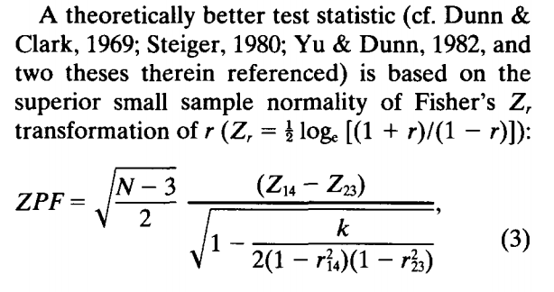
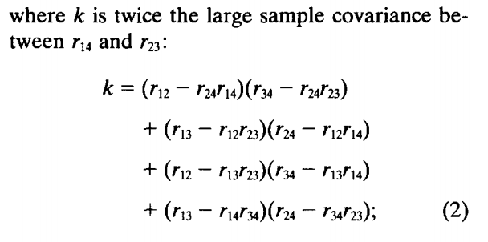

#### Article ID: APNGu
#### Pilot: Alicia Hofelich Mohr
#### Co-pilot: Tom Hardwicke  
#### Start date: Aug 10 2017
#### End date: Aug 11 2017  
#### Final verification: Tom Hardwicke
#### Date: Nov 8 2017

-------

#### Methods summary: 
In study 1, 20 participants rated the percieved warmth and competence of 1000 photographs of faces. These ratings were compared with previously collected ratings of trutworthiness and dominance, respectively, for each of the images to determine the similarity between the judgements. Correlations were used to compare each pair of ratings, and the magnitude of the correlations were compared using the Fisher' Z transformation of the Pearson-Filon statistic. 

------

#### Target outcomes: 
> In order to assess the claim that trustworthiness and warmth are highly similar trait judgements, we correlated the warmth ratings from the current study with the previously collected trustworthiness ratings (Sutherland et al., 2013; see Fig. 2). The correlation between trustworthiness and warmth was substantial and highly significant: r = 0.78, p < 0.001, n = 1,000. Similarly, in order to assess the claim that dominance and competence are highly similar trait judgements, we correlated the competence ratings from the current study with the previously collected dominance ratings (Sutherland et al., 2013). The correlation for dominance and competence was significant but only moderate in size: r = 0.32, p < 0.001, n = 1,000. The size of the correlation between trustworthiness and warmth was significantly greater than the size of the correlation for dominance and competence: ZPF = 15.46, p < 0.001, n = 1,000 (for further details on the statistical test see Raghunathan, Rosenthal, & Rubin, 1996). It therefore appears that trustworthiness and warmth facial judgments are indeed highly similar. In contrast, dominance and competence facial judgments are less strongly related (see Fig. 2).
  

------

```{r global_options, include=FALSE}
knitr::opts_chunk$set(echo=TRUE, warning=FALSE, message=FALSE)

# prepare an empty report object, we will update this each time we run compareValues2()
reportObject <- data.frame("Article_ID" = NA, "valuesChecked" = 0, "eyeballs" = 0, "Total_df" = 0, "Total_p" = 0, "Total_mean" = 0, "Total_sd" = 0, "Total_se" = 0, "Total_ci" = 0, "Total_bf" = 0, "Total_t" = 0, "Total_F" = 0, "Total_es" = 0, "Total_median" = 0, "Total_irr" = 0, "Total_r" = 0, "Total_z" = 0, "Total_coeff" = 0, "Total_n" = 0, "Total_x2" = 0, "Total_other" = 0, "Insufficient_Information_Errors" = 0, "Decision_Errors" = 0, "Major_Numerical_Errors" = 0, "Minor_Numerical_Errors" = 0, "Major_df" = 0, "Major_p" = 0, "Major_mean" = 0, "Major_sd" = 0, "Major_se" = 0, "Major_ci" = 0, "Major_bf" = 0, "Major_t" = 0, "Major_F" = 0, "Major_es" = 0, "Major_median" = 0, "Major_irr" = 0, "Major_r" = 0, "Major_z" = 0, "Major_coeff" = 0, "Major_n" = 0, "Major_x2" = 0, "Major_other" = 0, "affectsConclusion" = NA, "error_typo" = 0, "error_specification" = 0, "error_analysis" = 0, "error_data" = 0, "error_unidentified" = 0, "Author_Assistance" = NA, "resolved_typo" = 0, "resolved_specification" = 0, "resolved_analysis" = 0, "resolved_data" = 0, "correctionSuggested" = NA, "correctionPublished" = NA)
```

## Step 1: Load packages

```{r}
library(tidyverse) # for data munging
library(knitr) # for kable table formating
library(haven) # import and export 'SPSS', 'Stata' and 'SAS' Files
library(readxl) # import excel files
library(CODreports) # custom report functions
library(psych)
```

## Step 2: Load data

It looks like the data we need are in tabs 2, 3, 4 (start with "exp1").

```{r}
exp1overall <- read_excel(path="data/data.xlsx", sheet="Exp1Overall")
exp1warm <- read_excel(path="data/data.xlsx", sheet="Exp1Warm")
exp1comp <- read_excel(path="data/data.xlsx", sheet="Exp1Comp")
```

## Step 3: Tidy data

Data seemed in sufficient format for analysis. However, since there were a few analysis columns in each the overall dataset, these columns are removed here:

```{r}
exp1overall <- select(exp1overall, `Face identity`:Competence)
```

## Step 4: Run analysis

First, calculate inter-rater reliability for the collected warmth and competence ratings. 

> The inter-rater reliabilities for warmth and competence were good (Cronbach’s alphas of a = 0.93 and a = 0.72 respectively). 

```{r}
#Warmth ratings
alpha.out <- alpha(as.matrix(select(exp1warm, starts_with("ppt"))))
reportObject <- compareValues2(reportedValue = "0.93", obtainedValue = alpha.out$total$raw_alpha, valueType = 'irr')

#Competence ratings
alpha.out <- alpha(as.matrix(select(exp1comp, starts_with("ppt"))))
reportObject <- compareValues2(reportedValue = "0.72", obtainedValue = alpha.out$total$raw_alpha, valueType = 'irr')
```

The alphas match for both. 

Next, run the correlation between trustworthiness and the average warmth rating. 

> The correlation between trustworthiness and warmth was substantial and highly significant: r = 0.78, p < 0.001, n = 1,000. 

```{r}
cor.out <- cor.test(exp1overall$Trustworthiness, exp1overall$Warmth)
r <- cor.out$estimate
p <- cor.out$p.value
reportObject <- compareValues2(reportedValue = "0.78", obtainedValue = r, valueType = 'r')
reportObject <- compareValues2(reportedValue = "eyeballMATCH", obtainedValue = cor.out$p.value, valueType = 'p')
```

This matches what was reported. 

Then, run the correlation between dominance and competence. 

> The correlation for dominance and competence was significant but only moderate in size: r = 0.32, p < 0.001, n = 1,000. 

```{r}
cor.out <- cor.test(exp1overall$Dominance, exp1overall$Competence)
r <- cor.out$estimate
p <- cor.out$p.value
reportObject <- compareValues2(reportedValue = "0.32", obtainedValue = r, valueType = 'r')
reportObject <- compareValues2(reportedValue = "eyeballMATCH", obtainedValue = cor.out$p.value, valueType = 'p')
```

This also matches what was reported. 

> The size of the correlation between trustworthiness and warmth was significantly greater than the size of the correlation for dominance and competence: ZPF = 15.46, p < 0.001, n = 1,000 (for further details on the statistical test see Raghunathan, Rosenthal, & Rubin, 1996). It therefore appears that trustworthiness and warmth facial judgments are indeed highly similar. In contrast, dominance and competence facial judgments are less strongly related (see Fig. 2).

Finally, compare the two correlation coefficients using the ZPF scoring algorithm described in Raghunathan et al., 1996. 





First, take the z-transformation of each correlation coefficient, using the function "fisherz" in the psych package:

```{r}
rtw <- round(cor(exp1overall$Trustworthiness, exp1overall$Warmth), 2)
rcd <- round(cor(exp1overall$Competence, exp1overall$Dominance), 2)

#confirm this function is using the same formula as above
fisherz

ztw <- fisherz(rtw)
zcd <- fisherz(rcd)
```

Next, calculate k

```{r}
rtc <- round(cor(exp1overall$Trustworthiness, exp1overall$Competence),2)
rcw <- round(cor(exp1overall$Warmth, exp1overall$Competence),2)
rdw <- round(cor(exp1overall$Dominance, exp1overall$Warmth), 2)
rtd <- round(cor(exp1overall$Trustworthiness, exp1overall$Dominance), 2)

(k = (rtc - rcw*rtw)*(rdw - rcw*rcd) + 
    (rtd - rtc*rcd)*(rcw - rtc*rtw) + 
    (rtc - rtd*rcd)*(rdw - rtd*rtw) +
    (rtd - rtw*rdw)*(rcw - rdw*rcd))
``` 

Then calculate the ZPF value. 

```{r}
(ZPF <- sqrt((1000-3)/2)*(ztw - zcd)/sqrt(1 - (k/(2*(1-rtw^2)*(1-rcd^2)))))

```

Find the p value based on this z score (assume a two-tailed test). 

```{r}
z_p <- 2*pnorm(1-ZPF)
```

> ZPF = 15.46, p < 0.001

```{r}
reportObject <- compareValues2(reportedValue = "15.46", obtainedValue = ZPF, valueType = 'other')
reportObject <- compareValues2(reportedValue = "eyeballMATCH", obtainedValue = z_p, valueType = 'p')
```

This looks close to what was reported, but with a slight numeric difference. 

## Step 5: Conclusion

Overall, this analysis was straightforward, sufficiently described in the article, and the data was sufficiently documented. The only other reporting information that may have been helpful is how the authors calculated the ZPF scores - whether they used a statistical package, website, or did it by hand. That could help explain the minor numeric inconsistencies. 

```{r}
reportObject$Article_ID <- "APNGu"
reportObject$affectsConclusion <- NA
reportObject$error_typo <- 0
reportObject$error_specification <- 0
reportObject$error_analysis <- 0
reportObject$error_data <- 0
reportObject$error_unidentified <- 0
reportObject$Author_Assistance <- F
reportObject$resolved_typo <- 0
reportObject$resolved_specification <- 0
reportObject$resolved_analysis <- 0
reportObject$resolved_data <- 0
reportObject$correctionSuggested <- NA
reportObject$correctionPublished <- NA

# decide on final outcome
if(reportObject$Decision_Errors > 0 | reportObject$Major_Numerical_Errors > 0 | reportObject$Insufficient_Information_Errors > 0){
  reportObject$finalOutcome <- "Failure"
  if(reportObject$Author_Assistance == T){
    reportObject$finalOutcome <- "Failure despite author assistance"
  }
}else{
  reportObject$finalOutcome <- "Success"
  if(reportObject$Author_Assistance == T){
    reportObject$finalOutcome <- "Success with author assistance"
  }
}

# save the report object
filename <- paste0("reportObject_", reportObject$Article_ID,".csv")
write_csv(reportObject, filename)

```

## Report Object

```{r, echo = FALSE}
# display report object in chunks
kable(reportObject[2:10], align = 'l')
kable(reportObject[11:20], align = 'l')
kable(reportObject[21:25], align = 'l')
kable(reportObject[26:30], align = 'l')
kable(reportObject[31:35], align = 'l')
kable(reportObject[36:40], align = 'l')
kable(reportObject[41:45], align = 'l')
kable(reportObject[46:51], align = 'l')
kable(reportObject[52:57], align = 'l')
```

## Session information

```{r session_info, include=TRUE, echo=TRUE, results='markup'}
devtools::session_info()
```
